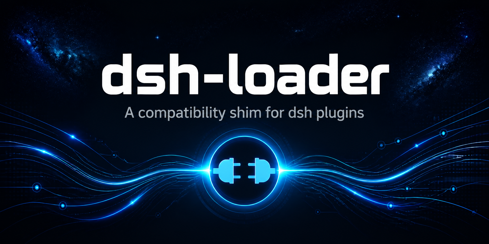

<div align="center">



# dshloader

**面向 dsh（DeepSeek Harness）的版本感知运行时兼容层：通过适配器注册表，让第三方插件在 dsh 升级改版后无需改动即可继续工作。**

[English](README.md) | [简体中文](#中文)

[](https://github.com/topics/dsh-plugin)
<a href="https://github.com/dsh-plugins/dsh-loader/actions/workflows/npm-publish.yml">
  
</a>
<a href="https://www.npmjs.com/package/@dsh-plugin/dsh-loader">
  
</a>
<a href="https://www.npmjs.com/package/@dsh-plugin/dsh-loader">
  
</a>

</div>

## 中文

**dsh**（DeepSeek Harness）cordis bundle 插件的运行时兼容层。dshloader 通过版本感知的**适配器注册表**，把第三方插件与 dsh 的内部服务名、模块路径、包名、RPC 细节解耦——dsh 升级改了内部 API 时，只需升级 dshloader，插件不用改。

### 为什么需要

dsh 迭代很快，内部 API 在版本间会变：

- `httpServer` 被重命名为 `webServer`——旧插件注入 `httpServer` 会永远挂起。
- 深层源码导入如
  `@deepseek-ai/dsh-client-runtime/src/client/sessions/context-provenance.ts`
  在 dsh 不再发布 `src/` 时直接报错。
- 客户端 UI 包如 `@deepseek-ai/dsh-client-ui-primitives` 在未来 dsh 版本中可能改名，直接 import 的插件全部会坏。
- 官方 `dsh-host-apiproxy` 硬编码了 settings namespace 白名单，第三方设置卡片无法出现在 Web UI 中。

dshloader 把这些（以及未来的）破坏性变更吸收到**稳定 API** 后面：host 侧的 `ctx.dshLoader`、浏览器侧的 `window.__dshLoader__`、以及包导入的 `@dsh-plugin/dsh-loader/*` 稳定 subpath。

### 快速上手

#### 1. 安装 dshloader 到 profile

```sh
dsh plugin --profile <name> add /path/to/dshloader
# 或
DSH_HOME=~/.dsh npx dshloader setup <name>
```

#### 2. 插件 `package.json`——只依赖 dshloader

```json
{
  "dependencies": {
    "@dsh-plugin/dsh-loader": "link:..."
  }
}
```

> **插件不允许声明任何 `@deepseek-ai/*` 依赖。** 所有 dsh 包都通过 dshloader 的稳定 subpath 访问。

#### 3. Host 侧——用 `ctx.dshLoader`

```js
export const inject = ['dshLoader'];

export async function apply(ctx) {
  // Settings：注册 namespace
  const scope = ctx.dshLoader.settings.register('my-plugin', schema);

  // Web：注册路由和 WebSocket upgrade
  ctx.dshLoader.web.get('/api/my-plugin/status', (req, res) => res.json({ ok: true }));
  ctx.dshLoader.web.registerUpgrade({ path: '/ws/my-plugin', handler: fn });

  // Services：读取 cordis 服务
  const sessions = ctx.dshLoader.services.get('sessions');
}
```

#### 4. 通过稳定 subpath 导入 dsh 包

```js
// Host 包
const { defineTool } = require('@dsh-plugin/dsh-loader/tools');

// Client UI 包（在 client bundle 源码中）
import { IconCloseFill14 } from '@dsh-plugin/dsh-loader/ui-primitives';
```

**稳定 subpath → dsh 真实包名映射（dsh 1.x）：**

| 稳定 subpath | dsh 真实包名 |
|---|---|
| `@dsh-plugin/dsh-loader/tools` | `@deepseek-ai/dsh-tools` |
| `@dsh-plugin/dsh-loader/llm` | `@deepseek-ai/dsh-llm` |
| `@dsh-plugin/dsh-loader/agent` | `@deepseek-ai/dsh-agent` |
| `@dsh-plugin/dsh-loader/settings` | `@deepseek-ai/dsh-settings` |
| `@dsh-plugin/dsh-loader/ui-primitives` | `@deepseek-ai/dsh-client-ui-primitives` |
| `@dsh-plugin/dsh-loader/ui-slots` | `@deepseek-ai/dsh-client-ui-slots` |
| `@dsh-plugin/dsh-loader/ui-settings` | `@deepseek-ai/dsh-client-ui-settings/client` |
| `@dsh-plugin/dsh-loader/web-react` | `@deepseek-ai/dsh-client-web-react` |
| `@dsh-plugin/dsh-loader/schema-form` | `@deepseek-ai/dsh-client-schema-form` |
| `@dsh-plugin/dsh-loader/runtime` | `@deepseek-ai/dsh-client-runtime/client` |

dsh 改包名时，只需改 dshloader 适配器——插件源码和 bundle 不用动。

#### 5. Client 侧——用 `window.__dshLoader__`

```js
// 读取 cordis client 服务
const conv = window.__dshLoader__.services.get('conversation');

// 运行时注册包名别名（兜底用）
window.__dshLoader__.registerPackageAlias('@old/pkg', '@new/pkg');
```

#### 6. 构建配置——把稳定 subpath 加入 external

```ts
const CLIENT_EXTERNALS = [
  'react', 'react/jsx-runtime', 'react-dom', 'react-dom/client', 'cordis',
  '@dsh-plugin/dsh-loader/ui-primitives',
  '@dsh-plugin/dsh-loader/ui-slots',
  '@dsh-plugin/dsh-loader/ui-settings',
  '@dsh-plugin/dsh-loader/web-react',
  '@dsh-plugin/dsh-loader/schema-form',
  '@dsh-plugin/dsh-loader/runtime',
]
```

### 工作原理

```
plugin ──▶ ctx.dshLoader.{settings,web,services} ──▶ dshloader 适配器
                                                        │
                                                        ▼
                                              真实 dsh（当前版本）

plugin bundle ──▶ require('@dsh-plugin/dsh-loader/ui-primitives')
                        │
                        ▼（__ModuleLoader__ wrapper 映射稳定名）
                  require('@deepseek-ai/dsh-client-ui-primitives')
                        │
                        ▼
                  dsh 模块表
```

1. **版本探测** 读取 `node_modules/@deepseek-ai/dsh/package.json`（或 `DSHLOADER_DSH_VERSION`）。
2. **适配器注册表** 选择最适合当前版本的适配器（精确 → 范围 → 最近低版本回退 → 报错）。
3. 选中的**适配器** 注册服务别名、安装包名映射钩子（host: `Module._resolveFilename`；client: `__ModuleLoader__.load` wrapper）、以及（仅在开启时）settings 白名单绕过桥接。所有注册通过 `ctx.reflect.provide` / `ctx.effect`，cordis 在 fiber 卸载时自动回收。

> **加载顺序无关。** cordis 是响应式依赖注入：声明了 `inject: [...]` 的插件会停在 `PENDING` 状态，直到依赖的服务出现，与 dshloader 在 `cordis.patch.yml` 中的位置无关。

### Settings 白名单绕过（`exposeAllNamespaces`）

默认**不绕过**官方 settings namespace 白名单。需要时显式开启：

- 环境变量：`DSHLOADER_EXPOSE_ALL_SETTINGS=1`
- profile `package.json`：`dsh.dshloader.exposeAllNamespaces: true`

> **安全权衡**：开启后会移除官方对浏览器 settings 访问的默认拒绝边界。仅在信任所有已安装插件的 profile 中开启。

### CLI

```
dshloader setup <profile>        注入 dshloader 到 profile（依赖 + patch）。
dshloader dump-config <profile>  运行 `dsh --profile <name> --dump-config`。
dshloader info [profile]         打印 loader 版本、探测到的 dsh 版本、选中的适配器。
```

### 回滚 / 禁用

- 单次启动禁用：`DSHLOADER_DISABLE=1 dsh web`
- 移除：`dsh plugin --profile <name> rm @dsh-plugin/dsh-loader`

### 项目结构

```
src/
  index.ts            host bundle 入口（name / inject / apply）
  client.ts           client bundle 入口（immediately tier）
  api.ts              DshLoaderHostAPI 构造
  registry.ts         适配器注册表 + 版本探测
  types.ts            共享 host/client TypeScript 类型
  version.ts          loader 版本 + 日志前缀
  stable/             稳定 subpath re-export（ui-primitives、tools 等）
  services/
    settings.ts       settings 稳定 API
    web.ts            web 稳定 API
    services.ts       services 稳定 API（get / alias）
  adapters/
    dsh-1-x.ts        dsh 1.x 适配器
    index.ts          适配器注册
  setup.ts            profile 注入 + dump-config + info
bin/dshloader.mjs     CLI 入口
dist/                 编译后的 host 产物（tsc 输出，已 git-ignore）
lib/                  编译后的 client bundle（tsdown 输出，已 git-ignore）
tsconfig.json         typecheck 配置
tsconfig.build.json   host 构建配置（产出 dist/）
tsdown.client.config.mjs  client bundle 构建配置
docs/
  api.md              完整 API 参考
  design.md           设计文档
tests/                L1（单元）/ module（L2）/ integration（L3）
examples/
  sample-plugin/      最小示例插件
  dsh-aux-state/      仅用 ctx.dshLoader 的示例
```

### 开发

```sh
pnpm install
npm run typecheck   # 类型检查 src/**/*.ts
npm run build       # 编译 host（dist/）+ client bundle（lib/）
npm test            # 全部测试
npm run test:l1     # 单元测试
npm run test:l2     # 模块测试
npm run test:l3     # 集成测试
```

Node.js >= 18，`node --test`，无额外测试框架。

### 许可证

LGPL-3.0-only（GNU 宽通用公共许可证第 3 版）。参见 [LICENSE](./LICENSE)。
