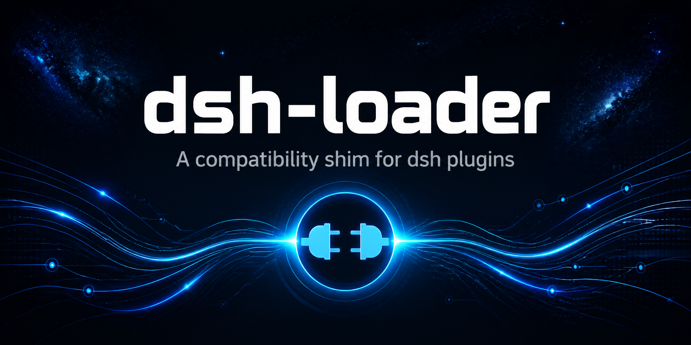

<div align="center">



# dshloader

**面向 dsh（DeepSeek Harness）的版本感知运行时兼容层：按 patch 适配宿主，统一管理插件配置与资源生命周期。**

[English](README.md) | [简体中文](#中文)

[](https://github.com/topics/dsh-plugin)
<a href="https://github.com/dsh-plugins/dsh-loader/actions/workflows/npm-publish.yml">
  
</a>
<a href="https://www.npmjs.com/package/@dsh-plugin/dsh-loader">
  
</a>
<a href="https://www.npmjs.com/package/@dsh-plugin/dsh-loader">
  
</a>

</div>

## 中文

dsh-loader **2.0.0** 为每个受支持的 dsh patch 提供独立适配器，保留稳定的宿主能力入口和客户端 UI facade，新增独立的 config-api 与统一配置表单。

支持 `0.1.5`、`0.1.6`、`0.1.7`、`0.2.0`、`0.2.1`、`0.2.2` 系列（含预发布版），发布清单与依赖解析冻结于 2026-10-30。未知 patch、未知主版本和更旧版本直接拒绝加载。Node 要求 >=24.9.0。

### 安装和使用

```sh
npm run build
npm pack
node bin/dshloader.mjs setup <profile-name>
npm install --prefix <profile-directory> <absolute-path-to-dsh-plugin-dsh-loader-2.0.0.tgz>
```

`setup` 向指定 profile 写入依赖和 Cordis patch；随后在同一 profile 安装本地打包文件并重启 dsh。上述步骤不会发布 npm 包。

插件依赖 `dshLoader` 后可使用 `config`、`settings`、`web`、`services`、`registry`、`llm`、`dsh`、`patch`。客户端入口为 `@dsh-plugin/dsh-loader/client`，宿主模块子路径同时提供 ESM 与 CJS 出口。

### 统一插件配置

配置通过 `config.register(ownerCtx, template)` 声明，保存到 `<profile>/config/<插件ID>/config.json`，不依赖 `exposeAllNamespaces`。模板支持分组、嵌套对象和数组、密码、校验及声明式显隐。

模板也可声明临时操作区，宿主通过 `handle.registerOperation()` 注册处理器。支持异步选项、选择回填、文档编辑/导入、只读 Markdown/列表/JSON、可取消长任务及资源 revision 冲突控制；操作草稿不写入配置文件。

0.1.6-alpha.2 之前在“更多 → 设置 → 插件配置”显示聚合页；此版本起进入对应插件详情页。每个插件一个默认折叠卡片，loader 统一生成字段、等宽 label 和 fieldset 分组。保存、取消修改和恢复默认值按卡片独立操作，冲突保留草稿。

- [config-api 与完整示例](docs/config-api.md)
- [版本支持和冻结依据](docs/support.md)
- [1.x → 2.0 迁移](docs/migration-2.0.md)
- [公共 API](docs/api.md)、[架构](docs/design.md)、[UI](docs/ui.md)、[控件](docs/ui-kit.md)
- [验证记录](docs/verification-2.0.md)
- [可运行配置插件](examples/config-plugin/index.mjs)

### 开发验证

```sh
npm run typecheck
npm run build
npm test
npm run test:package
npm run test:browser
```

浏览器验收服务器使用仓库 `.cache/browser/profile`，不读写用户实际 profile。版本矩阵使用已提交的发布契约与完整 npm 锁文件；更新流程见支持表。不会自动迁移其他插件的旧配置，也不会在构建或测试时发布 npm 包。
